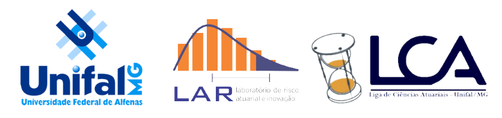

```{r setup, include=FALSE}
source("setup_knitr.R")
```

[](https://travis-ci.org/walefmachado/portal-halley)

## O Portal Halley

\ \ \ \ \ \ Este site é fruto de um projeto do curso de Ciências Atuariais da Universidade Federal de Alfenas.   

\ \ \ \ \ \  Nosso objetivo inicial foi a produção de um curso de apoio ao curso presencial de matemática atuarial ministrado aos alunos do curso bacharelado interdisciplinar em ciência e economia como disciplina diretiva ao curso de ciências atuariais. Esse objetivo pode ser naturalmente ampliado aos profissionais da área e usuários interessados. 

\ \ \ \ \ \  Com o intuito de fornecer uma base educacional, os principais objetivos deste trabalho são integrar teoria dos produtos atuariais, demonstrando sua grande variedade, com uma abordagem mais prática e interativa.

## Atuária – o que é isso?

\ \ \ \ \ \ A ciência atuarial ou atuária é a ciência das técnicas específicas de análise de riscos e expectativas financeiros e econômicos, principalmente na administração de seguros, fundos de pensão e operadoras de saúde. A atuária é uma área de conhecimento multidisplinar, onde o domínio de conceitos em  matemática, estatística, economia, finanças e contabilidade são fundamentais para o entendimento dos modelos atuariais mais elementares.

\ \ \ \ \ \ Essa ciência surgiu há cerca de 150 anos na Inglaterra, estudando basicamente a mortalidade da população. A partir de então, ela voltava-se para o cálculo da expectativa de vida, com interesse nas questões de aposentadoria e pensão.

\ \ \ \ \ \ No século XX, a área de seguros expandiu a abrangência do estudo atuarial, e a inserção cada vez mais frequ##ente das empresas de seguro e pensão no mercado financeiro, fez com que a ciência atuarial se especializasse cada vez mais em campos econômicos e financeiros. A partir de então as empresas seguradoras passaram a oferecer programas de seguro de vida e outras especializações, o que gerou cada vez maior necessidade do desenvolvimento das ciências atuariais.

\ \ \ \ \ \ Os estudos da atuária dividem-se em dois principais ramos: o vida e o não-vida. O primeiro trata das questões de longo prazo, como aposentadoria, pensões, seguros de vida e saúde. O segundo está mais relacionado a característcas de curto prazo, como como os seguros de automóveis e responsabilidade civil.

## Apoio:
```{r, echo=FALSE, fig.align='center', dpi = 60}

```
